# List of MicroSims

This book includes **51 interactive MicroSims** — self-contained, browser-based visualizations you can explore directly. Click any thumbnail to open the MicroSim.

<!-- This gallery is generated by generate-sims-index.py — edits here will be overwritten. -->

  <a href="ai-flywheel-visualization/" title="AI Flywheel Visualization" style="display:block;border:1px solid #e3e7ec;border-radius:8px;overflow:hidden;text-decoration:none;color:inherit;box-shadow:0 1px 3px rgba(0,0,0,0.08);">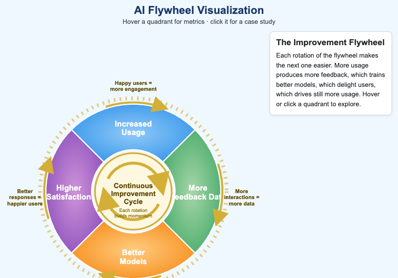AI Flywheel Visualization</a>
  <a href="ai-performance-chart/" title="AI Performance Improvement Exceeds Moore&#x27;s Law" style="display:block;border:1px solid #e3e7ec;border-radius:8px;overflow:hidden;text-decoration:none;color:inherit;box-shadow:0 1px 3px rgba(0,0,0,0.08);">no previewAI Performance Improvement Exceeds Moore&#x27;s Law</a>
  <a href="byte-pair-encoding-merge-process/" title="Byte Pair Encoding Merge Process" style="display:block;border:1px solid #e3e7ec;border-radius:8px;overflow:hidden;text-decoration:none;color:inherit;box-shadow:0 1px 3px rgba(0,0,0,0.08);">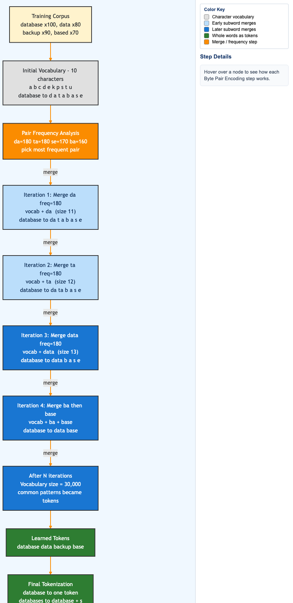Byte Pair Encoding Merge Process</a>
  <a href="chat-interface-anatomy/" title="Chat Interface Anatomy" style="display:block;border:1px solid #e3e7ec;border-radius:8px;overflow:hidden;text-decoration:none;color:inherit;box-shadow:0 1px 3px rgba(0,0,0,0.08);">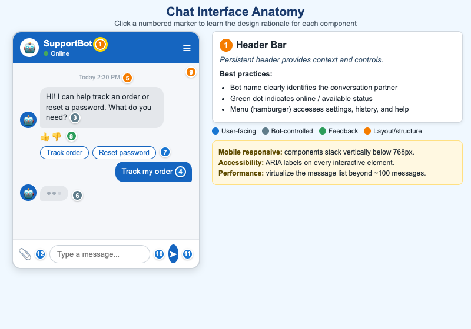Chat Interface Anatomy</a>
  <a href="chat-widget-integration-patterns/" title="Chat Widget Integration Patterns" style="display:block;border:1px solid #e3e7ec;border-radius:8px;overflow:hidden;text-decoration:none;color:inherit;box-shadow:0 1px 3px rgba(0,0,0,0.08);">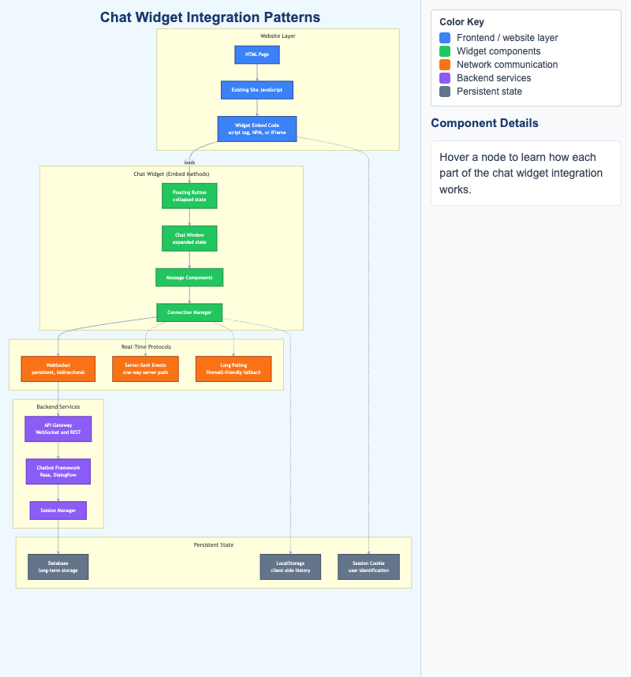Chat Widget Integration Patterns</a>
  <a href="chatbot-latency-breakdown/" title="Chatbot Response Latency Breakdown" style="display:block;border:1px solid #e3e7ec;border-radius:8px;overflow:hidden;text-decoration:none;color:inherit;box-shadow:0 1px 3px rgba(0,0,0,0.08);">no previewChatbot Response Latency Breakdown</a>
  <a href="context-management-state-machine/" title="Context Management State Machine" style="display:block;border:1px solid #e3e7ec;border-radius:8px;overflow:hidden;text-decoration:none;color:inherit;box-shadow:0 1px 3px rgba(0,0,0,0.08);">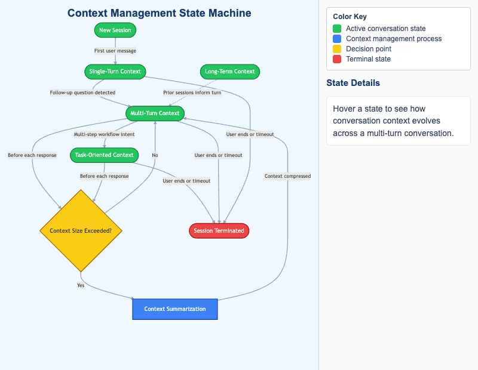Context Management State Machine</a>
  <a href="corporate-nervous-system-in-action/" title="Corporate Nervous System in Action" style="display:block;border:1px solid #e3e7ec;border-radius:8px;overflow:hidden;text-decoration:none;color:inherit;box-shadow:0 1px 3px rgba(0,0,0,0.08);">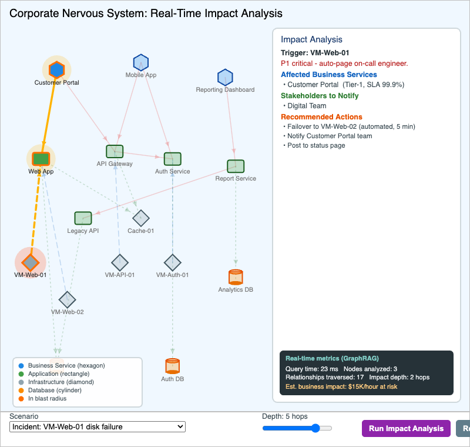Corporate Nervous System in Action</a>
  <a href="cypher-query-visualization/" title="Cypher Query Visualization" style="display:block;border:1px solid #e3e7ec;border-radius:8px;overflow:hidden;text-decoration:none;color:inherit;box-shadow:0 1px 3px rgba(0,0,0,0.08);">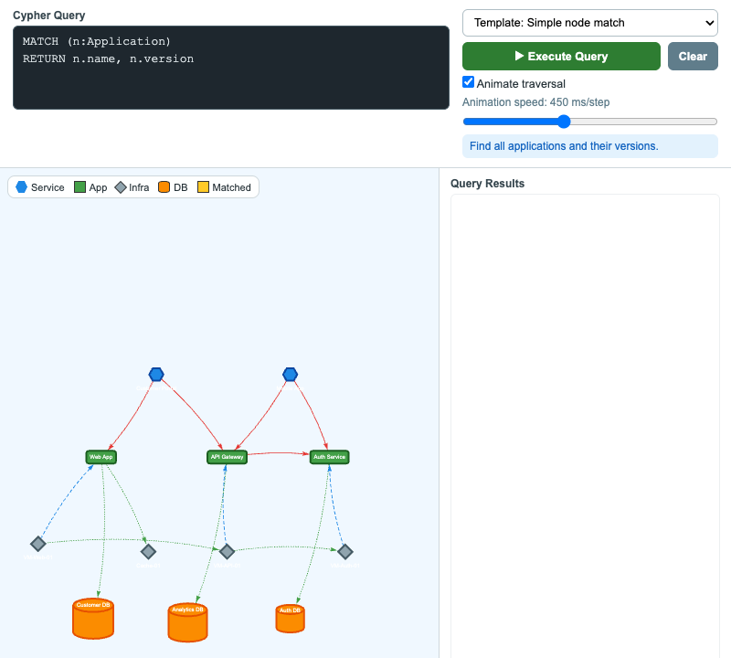Cypher Query Visualization</a>
  <a href="dependency-parse-tree/" title="Dependency Parse Tree" style="display:block;border:1px solid #e3e7ec;border-radius:8px;overflow:hidden;text-decoration:none;color:inherit;box-shadow:0 1px 3px rgba(0,0,0,0.08);">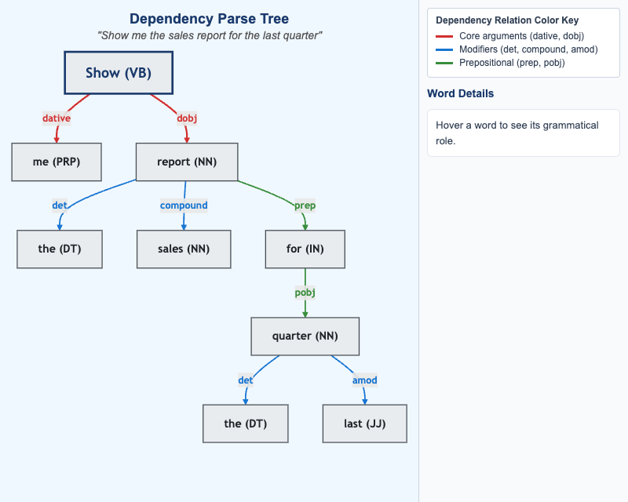Dependency Parse Tree</a>
  <a href="dialog-system-state-machine/" title="Dialog System State Machine" style="display:block;border:1px solid #e3e7ec;border-radius:8px;overflow:hidden;text-decoration:none;color:inherit;box-shadow:0 1px 3px rgba(0,0,0,0.08);">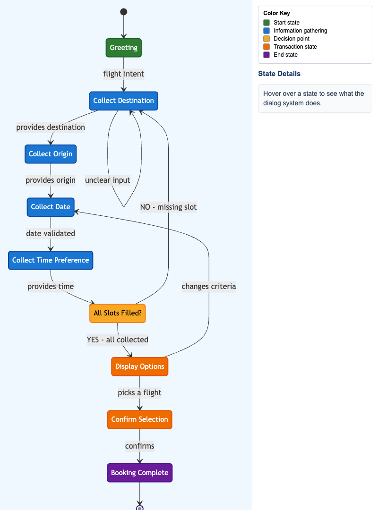Dialog System State Machine</a>
  <a href="dimensionality-reduction-visualization/" title="Dimensionality Reduction Visualization" style="display:block;border:1px solid #e3e7ec;border-radius:8px;overflow:hidden;text-decoration:none;color:inherit;box-shadow:0 1px 3px rgba(0,0,0,0.08);">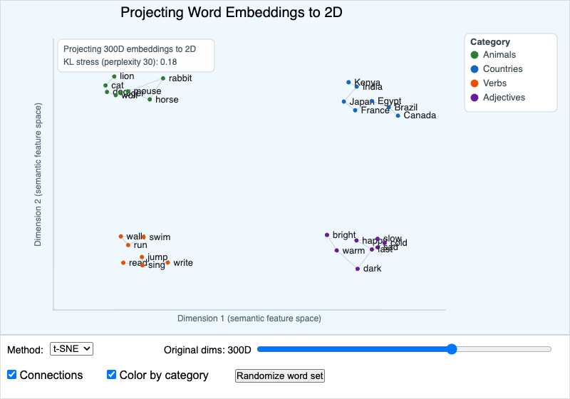Dimensionality Reduction Visualization</a>
  <a href="embedding-model-comparison/" title="Embedding Model Comparison" style="display:block;border:1px solid #e3e7ec;border-radius:8px;overflow:hidden;text-decoration:none;color:inherit;box-shadow:0 1px 3px rgba(0,0,0,0.08);">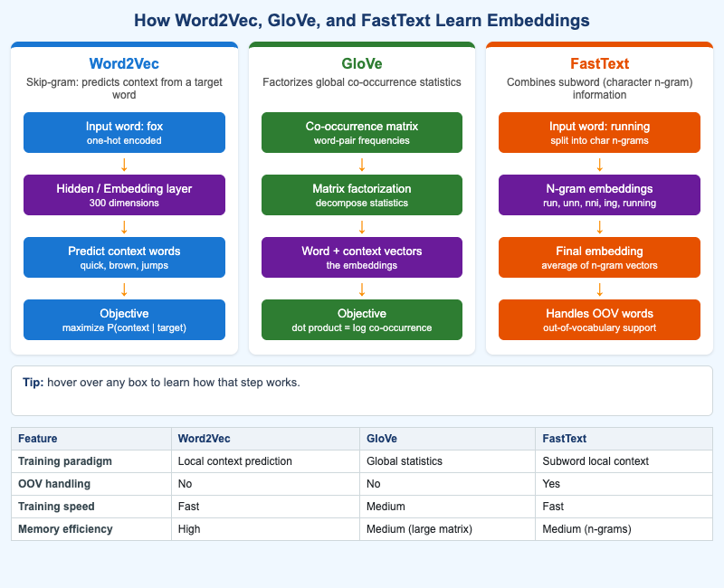Embedding Model Comparison</a>
  <a href="entity-extraction-architecture/" title="Entity Extraction Architecture" style="display:block;border:1px solid #e3e7ec;border-radius:8px;overflow:hidden;text-decoration:none;color:inherit;box-shadow:0 1px 3px rgba(0,0,0,0.08);">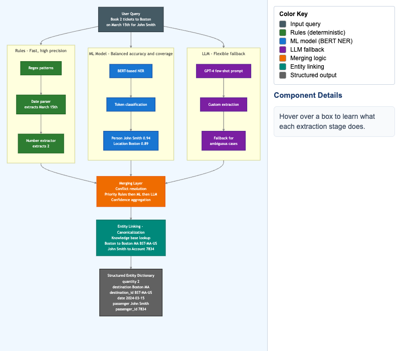Entity Extraction Architecture</a>
  <a href="ai-timeline/" title="Evolution of Artificial Intelligence Timeline" style="display:block;border:1px solid #e3e7ec;border-radius:8px;overflow:hidden;text-decoration:none;color:inherit;box-shadow:0 1px 3px rgba(0,0,0,0.08);">no previewEvolution of Artificial Intelligence Timeline</a>
  <a href="faq-system-architecture/" title="FAQ System Architecture" style="display:block;border:1px solid #e3e7ec;border-radius:8px;overflow:hidden;text-decoration:none;color:inherit;box-shadow:0 1px 3px rgba(0,0,0,0.08);">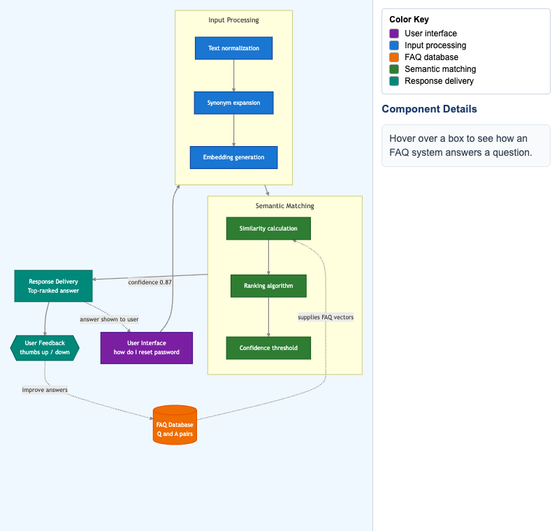FAQ System Architecture</a>
  <a href="feedback-button-ui-patterns/" title="Feedback Button UI Patterns" style="display:block;border:1px solid #e3e7ec;border-radius:8px;overflow:hidden;text-decoration:none;color:inherit;box-shadow:0 1px 3px rgba(0,0,0,0.08);">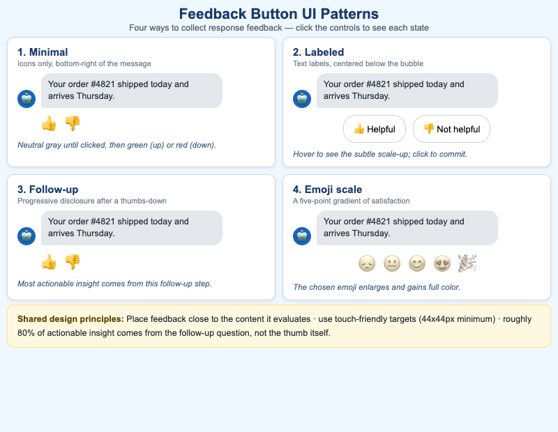Feedback Button UI Patterns</a>
  <a href="feedback-loop-system-architecture/" title="Feedback Loop System Architecture" style="display:block;border:1px solid #e3e7ec;border-radius:8px;overflow:hidden;text-decoration:none;color:inherit;box-shadow:0 1px 3px rgba(0,0,0,0.08);">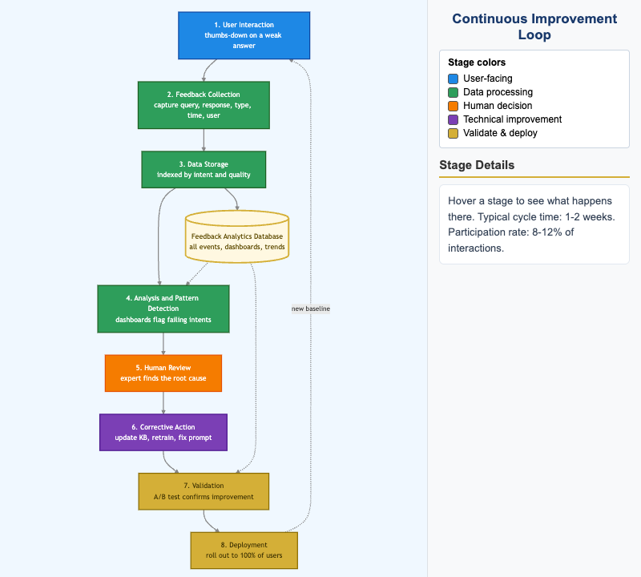Feedback Loop System Architecture</a>
  <a href="framework-comparison-matrix/" title="Framework Comparison Matrix" style="display:block;border:1px solid #e3e7ec;border-radius:8px;overflow:hidden;text-decoration:none;color:inherit;box-shadow:0 1px 3px rgba(0,0,0,0.08);">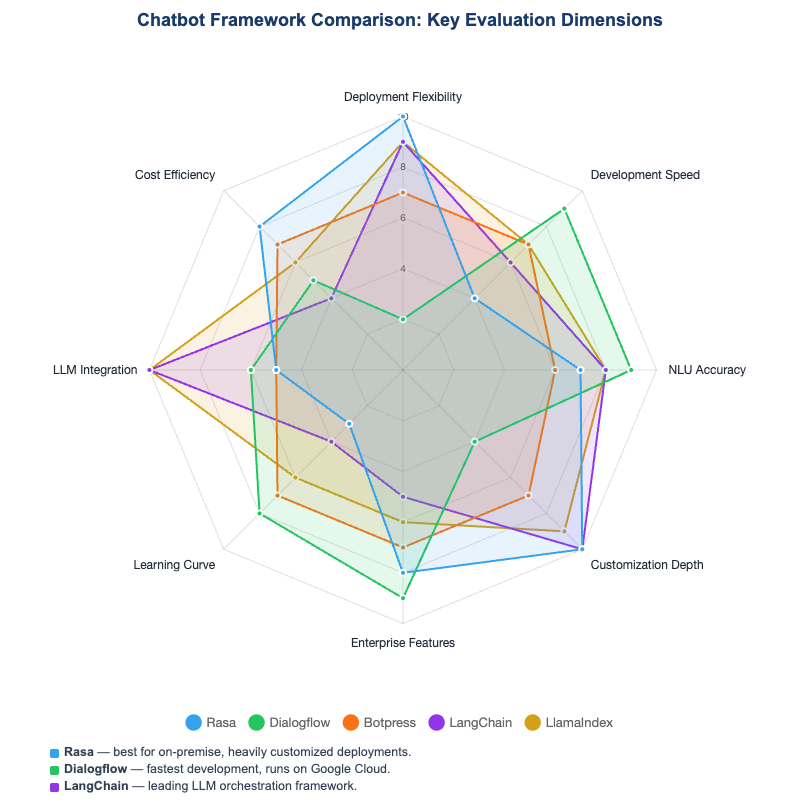Framework Comparison Matrix</a>
  <a href="graph-data-model-visualization/" title="Graph Data Model Visualization" style="display:block;border:1px solid #e3e7ec;border-radius:8px;overflow:hidden;text-decoration:none;color:inherit;box-shadow:0 1px 3px rgba(0,0,0,0.08);">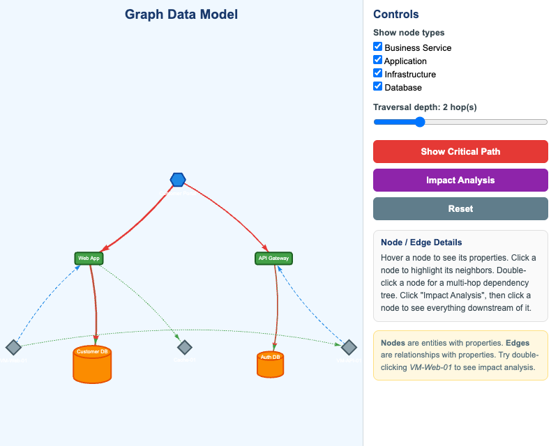Graph Data Model Visualization</a>
  <a href="intent-classification-pipeline/" title="Intent Classification Pipeline" style="display:block;border:1px solid #e3e7ec;border-radius:8px;overflow:hidden;text-decoration:none;color:inherit;box-shadow:0 1px 3px rgba(0,0,0,0.08);">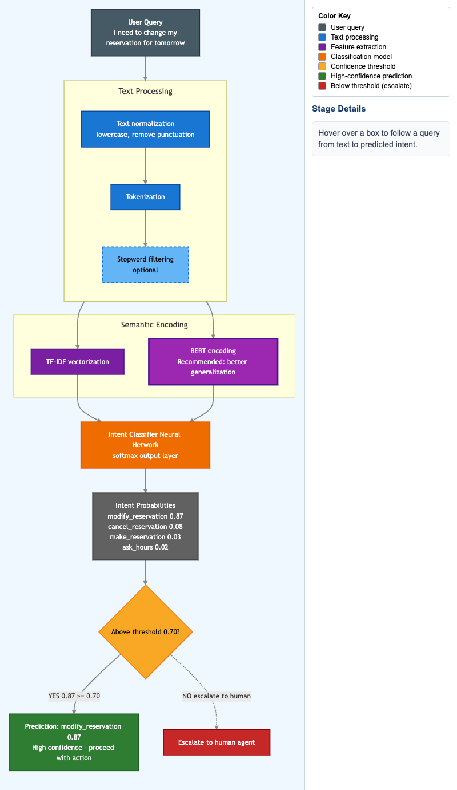Intent Classification Pipeline</a>
  <a href="regex-matcher/" title="Interactive Regular Expression Pattern Matcher" style="display:block;border:1px solid #e3e7ec;border-radius:8px;overflow:hidden;text-decoration:none;color:inherit;box-shadow:0 1px 3px rgba(0,0,0,0.08);">no previewInteractive Regular Expression Pattern Matcher</a>
  <a href="knowledge-source-categories/" title="Knowledge Source Categories" style="display:block;border:1px solid #e3e7ec;border-radius:8px;overflow:hidden;text-decoration:none;color:inherit;box-shadow:0 1px 3px rgba(0,0,0,0.08);">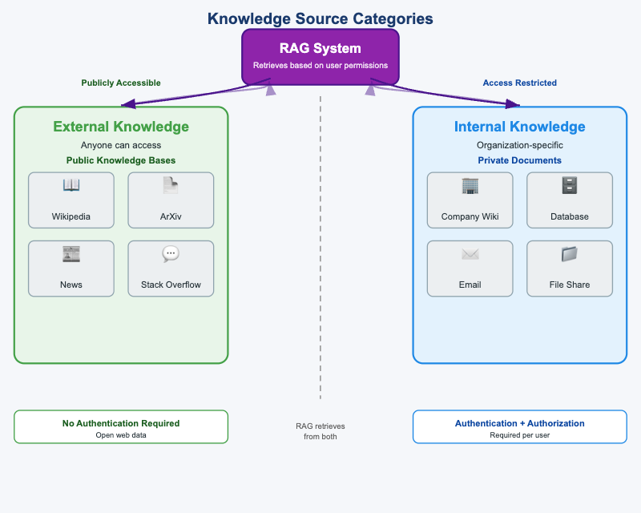Knowledge Source Categories</a>
  <a href="langchain-agent-architecture/" title="LangChain Agent Architecture" style="display:block;border:1px solid #e3e7ec;border-radius:8px;overflow:hidden;text-decoration:none;color:inherit;box-shadow:0 1px 3px rgba(0,0,0,0.08);">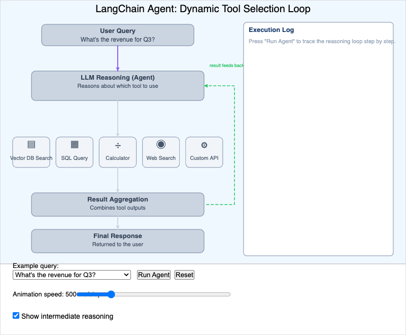LangChain Agent Architecture</a>
  <a href="latency-waterfall-visualization/" title="Latency Waterfall Visualization" style="display:block;border:1px solid #e3e7ec;border-radius:8px;overflow:hidden;text-decoration:none;color:inherit;box-shadow:0 1px 3px rgba(0,0,0,0.08);">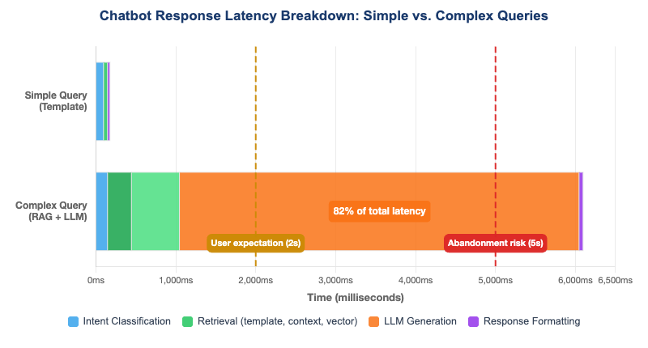Latency Waterfall Visualization</a>
  <a href="graph-viewer/" title="Learning Graph Viewer" style="display:block;border:1px solid #e3e7ec;border-radius:8px;overflow:hidden;text-decoration:none;color:inherit;box-shadow:0 1px 3px rgba(0,0,0,0.08);">no previewLearning Graph Viewer</a>
  <a href="named-entity-recognition-with-bio-tagging/" title="Named Entity Recognition with BIO Tagging" style="display:block;border:1px solid #e3e7ec;border-radius:8px;overflow:hidden;text-decoration:none;color:inherit;box-shadow:0 1px 3px rgba(0,0,0,0.08);">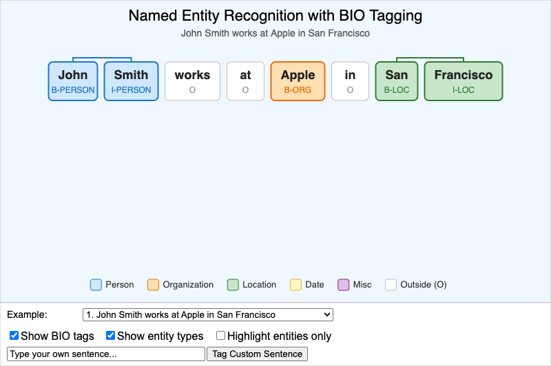Named Entity Recognition with BIO Tagging</a>
  <a href="natural-language-to-sql-conversion-pipeline/" title="Natural Language to SQL Conversion Pipeline" style="display:block;border:1px solid #e3e7ec;border-radius:8px;overflow:hidden;text-decoration:none;color:inherit;box-shadow:0 1px 3px rgba(0,0,0,0.08);">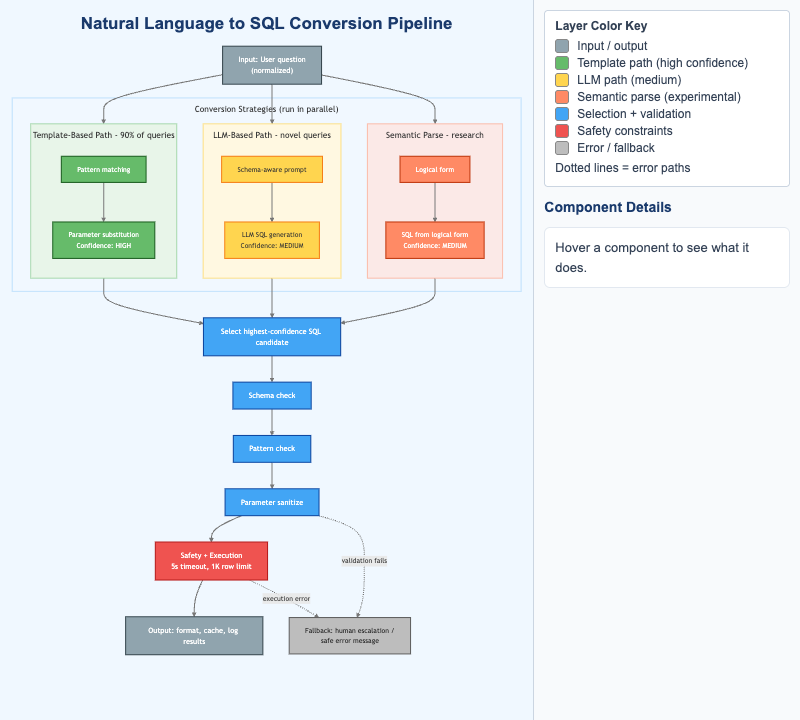Natural Language to SQL Conversion Pipeline</a>
  <a href="nlp-pipeline-architecture/" title="NLP Pipeline Architecture" style="display:block;border:1px solid #e3e7ec;border-radius:8px;overflow:hidden;text-decoration:none;color:inherit;box-shadow:0 1px 3px rgba(0,0,0,0.08);">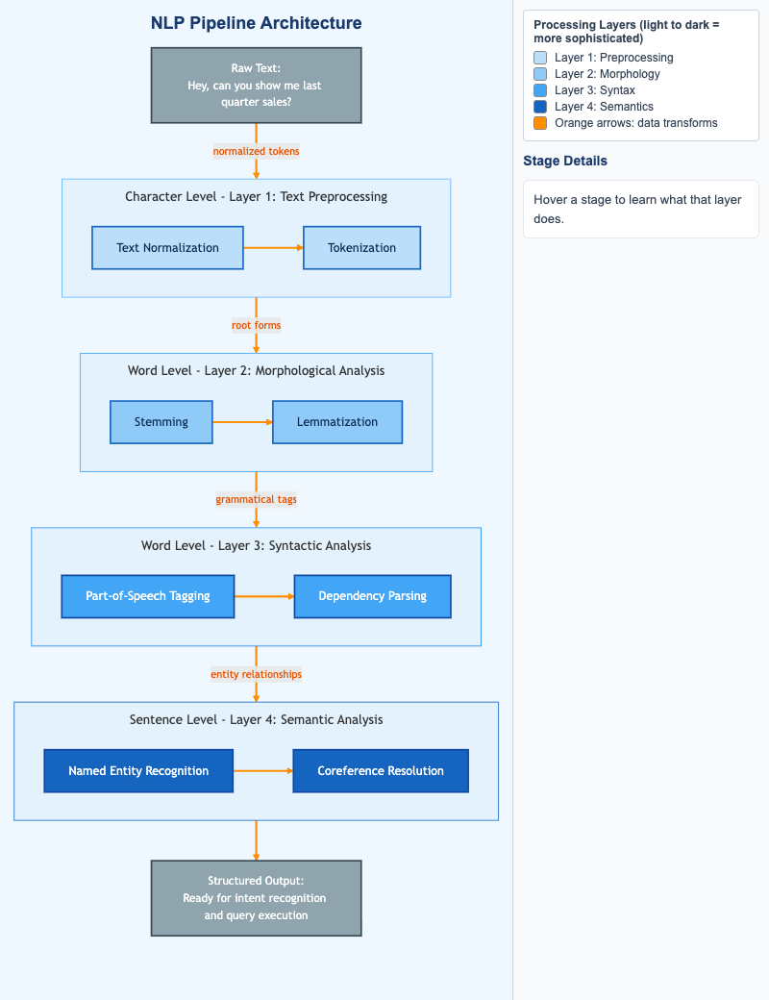NLP Pipeline Architecture</a>
  <a href="pareto-chart-for-query-distribution/" title="Pareto Chart for Query Distribution" style="display:block;border:1px solid #e3e7ec;border-radius:8px;overflow:hidden;text-decoration:none;color:inherit;box-shadow:0 1px 3px rgba(0,0,0,0.08);">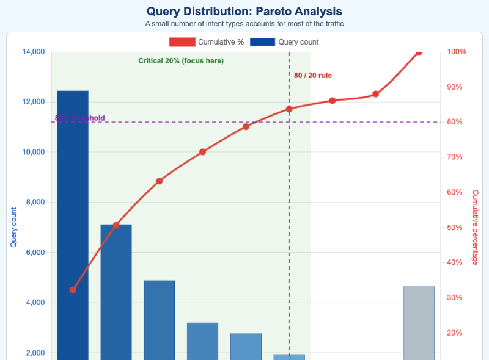Pareto Chart for Query Distribution</a>
  <a href="personalization-decision-tree/" title="Personalization Decision Tree" style="display:block;border:1px solid #e3e7ec;border-radius:8px;overflow:hidden;text-decoration:none;color:inherit;box-shadow:0 1px 3px rgba(0,0,0,0.08);">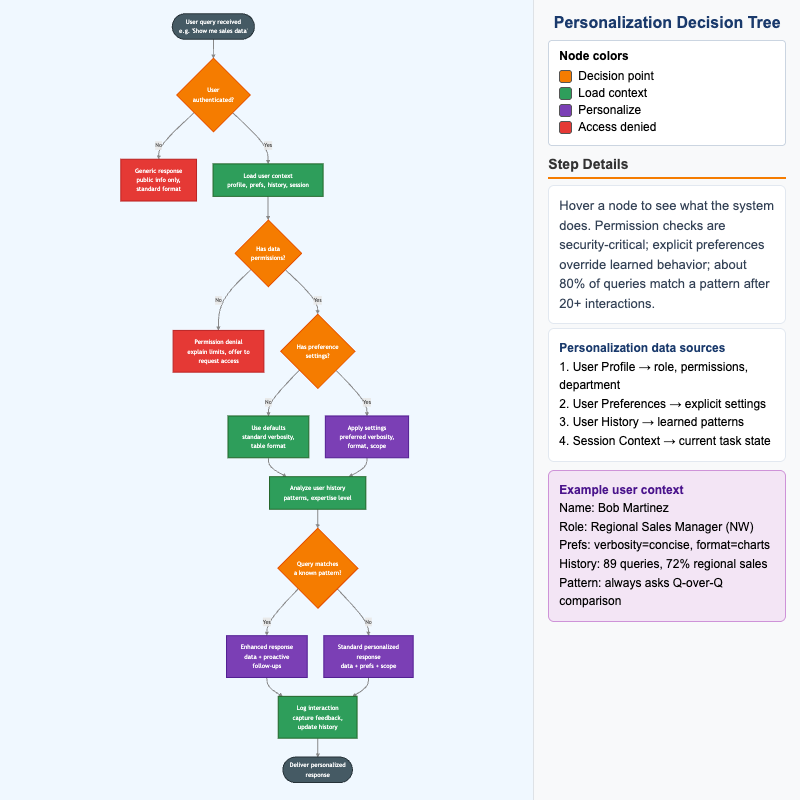Personalization Decision Tree</a>
  <a href="pos-tagging-process-flow/" title="POS Tagging Process Flow" style="display:block;border:1px solid #e3e7ec;border-radius:8px;overflow:hidden;text-decoration:none;color:inherit;box-shadow:0 1px 3px rgba(0,0,0,0.08);">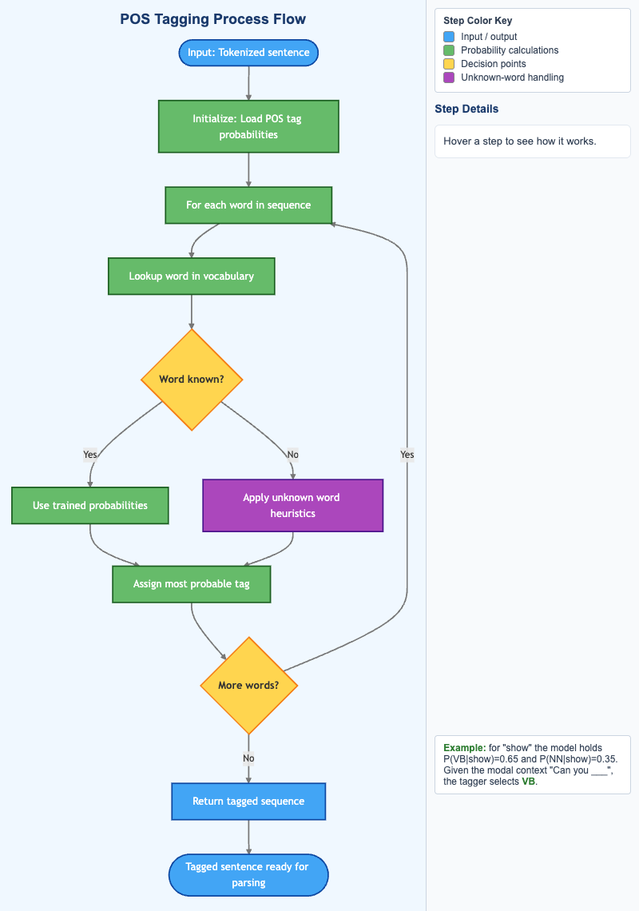POS Tagging Process Flow</a>
  <a href="production-pipeline-architecture/" title="Production Pipeline Architecture" style="display:block;border:1px solid #e3e7ec;border-radius:8px;overflow:hidden;text-decoration:none;color:inherit;box-shadow:0 1px 3px rgba(0,0,0,0.08);">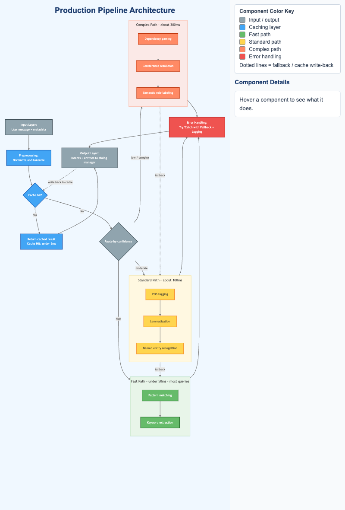Production Pipeline Architecture</a>
  <a href="query-template-matching-flow/" title="Query Template Matching Flow" style="display:block;border:1px solid #e3e7ec;border-radius:8px;overflow:hidden;text-decoration:none;color:inherit;box-shadow:0 1px 3px rgba(0,0,0,0.08);">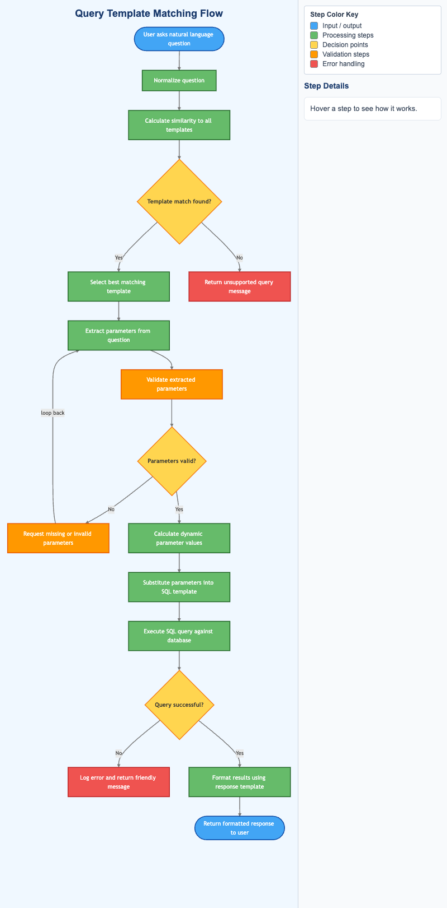Query Template Matching Flow</a>
  <a href="rag-limitations-overview/" title="RAG Limitations Overview" style="display:block;border:1px solid #e3e7ec;border-radius:8px;overflow:hidden;text-decoration:none;color:inherit;box-shadow:0 1px 3px rgba(0,0,0,0.08);">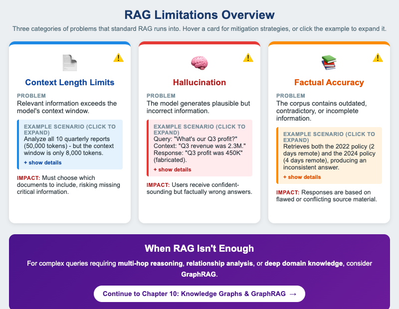RAG Limitations Overview</a>
  <a href="rag-microsim/" title="RAG MicroSim" style="display:block;border:1px solid #e3e7ec;border-radius:8px;overflow:hidden;text-decoration:none;color:inherit;box-shadow:0 1px 3px rgba(0,0,0,0.08);">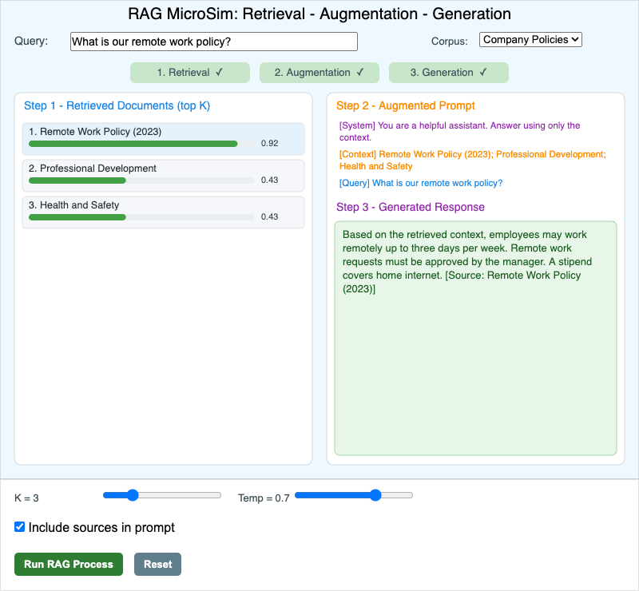RAG MicroSim</a>
  <a href="rag-three-step-process/" title="RAG Three-Step Process" style="display:block;border:1px solid #e3e7ec;border-radius:8px;overflow:hidden;text-decoration:none;color:inherit;box-shadow:0 1px 3px rgba(0,0,0,0.08);">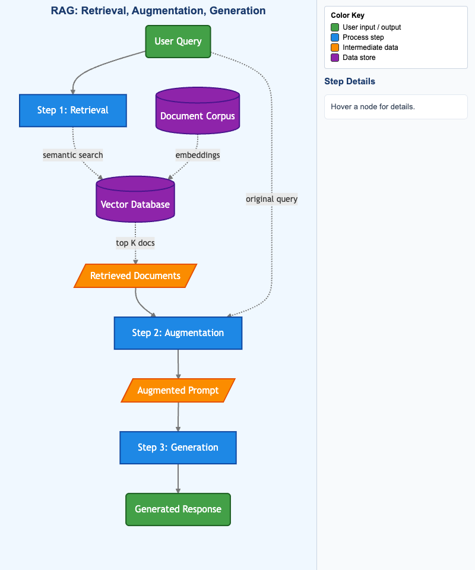RAG Three-Step Process</a>
  <a href="rag-vs-graphrag-architecture-comparison/" title="RAG vs GraphRAG Architecture Comparison" style="display:block;border:1px solid #e3e7ec;border-radius:8px;overflow:hidden;text-decoration:none;color:inherit;box-shadow:0 1px 3px rgba(0,0,0,0.08);">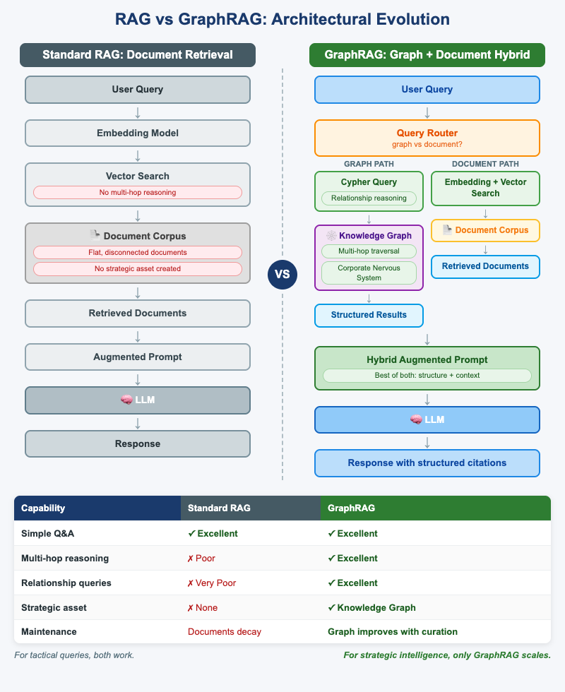RAG vs GraphRAG Architecture Comparison</a>
  <a href="rasa-architecture-components/" title="Rasa Architecture Components" style="display:block;border:1px solid #e3e7ec;border-radius:8px;overflow:hidden;text-decoration:none;color:inherit;box-shadow:0 1px 3px rgba(0,0,0,0.08);">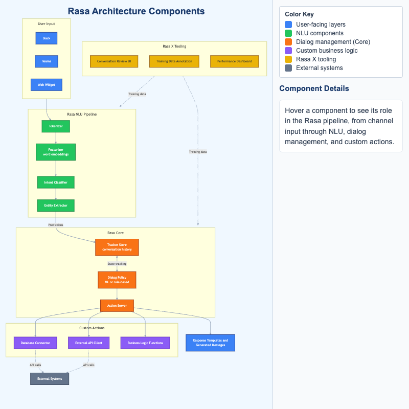Rasa Architecture Components</a>
  <a href="rbac-architecture/" title="RBAC Architecture" style="display:block;border:1px solid #e3e7ec;border-radius:8px;overflow:hidden;text-decoration:none;color:inherit;box-shadow:0 1px 3px rgba(0,0,0,0.08);">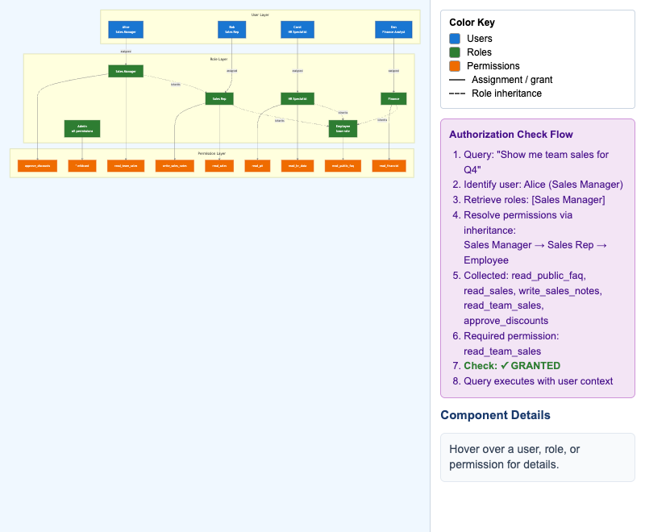RBAC Architecture</a>
  <a href="react-chat-component-architecture/" title="React Chat Component Architecture" style="display:block;border:1px solid #e3e7ec;border-radius:8px;overflow:hidden;text-decoration:none;color:inherit;box-shadow:0 1px 3px rgba(0,0,0,0.08);">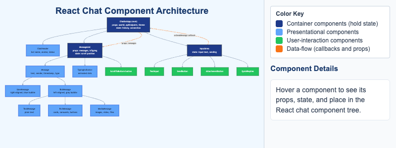React Chat Component Architecture</a>
  <a href="response-generation-architecture/" title="Response Generation Architecture" style="display:block;border:1px solid #e3e7ec;border-radius:8px;overflow:hidden;text-decoration:none;color:inherit;box-shadow:0 1px 3px rgba(0,0,0,0.08);">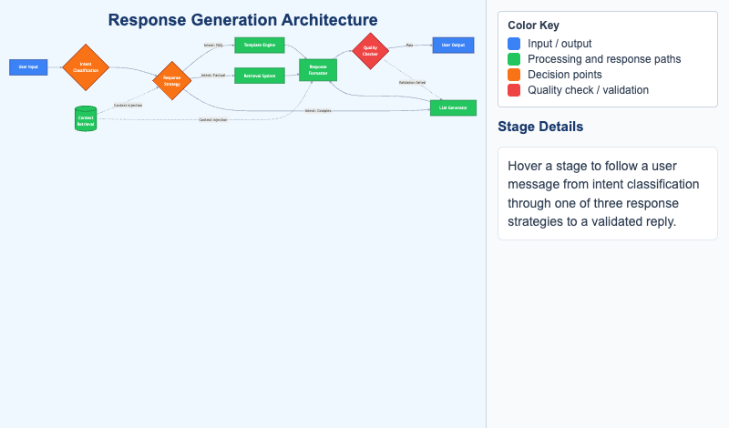Response Generation Architecture</a>
  <a href="text-processing-workflow/" title="Text Processing Pipeline Workflow" style="display:block;border:1px solid #e3e7ec;border-radius:8px;overflow:hidden;text-decoration:none;color:inherit;box-shadow:0 1px 3px rgba(0,0,0,0.08);">no previewText Processing Pipeline Workflow</a>
  <a href="text-to-graph/" title="Text-to-Knowledge-Graph Benchmark Comparison" style="display:block;border:1px solid #e3e7ec;border-radius:8px;overflow:hidden;text-decoration:none;color:inherit;box-shadow:0 1px 3px rgba(0,0,0,0.08);">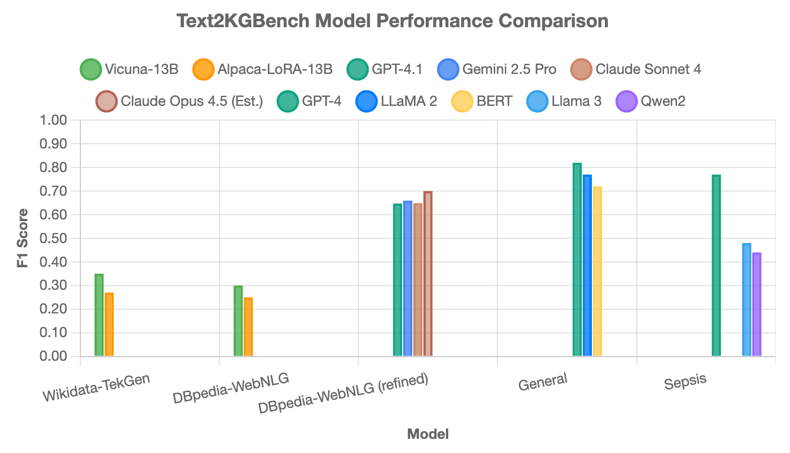Text-to-Knowledge-Graph Benchmark Comparison</a>
  <a href="text-to-graph-timeline/" title="Text2KGBench-LettrIA F1 Scores Timeline" style="display:block;border:1px solid #e3e7ec;border-radius:8px;overflow:hidden;text-decoration:none;color:inherit;box-shadow:0 1px 3px rgba(0,0,0,0.08);">no previewText2KGBench-LettrIA F1 Scores Timeline</a>
  <a href="transformer-architecture-for-language-models/" title="Transformer Architecture for Language Models" style="display:block;border:1px solid #e3e7ec;border-radius:8px;overflow:hidden;text-decoration:none;color:inherit;box-shadow:0 1px 3px rgba(0,0,0,0.08);">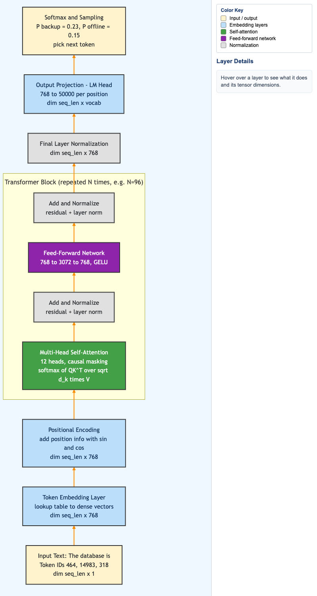Transformer Architecture for Language Models</a>
  <a href="user-context-data-model/" title="User Context Data Model" style="display:block;border:1px solid #e3e7ec;border-radius:8px;overflow:hidden;text-decoration:none;color:inherit;box-shadow:0 1px 3px rgba(0,0,0,0.08);">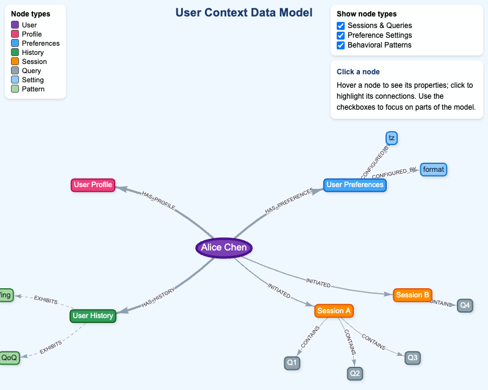User Context Data Model</a>
  <a href="user-query-components/" title="User Query Components" style="display:block;border:1px solid #e3e7ec;border-radius:8px;overflow:hidden;text-decoration:none;color:inherit;box-shadow:0 1px 3px rgba(0,0,0,0.08);">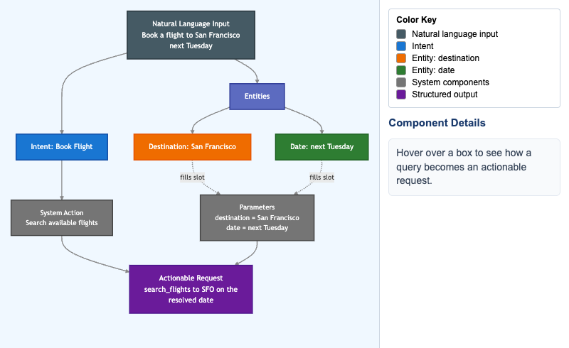User Query Components</a>
  <a href="vector-database-architecture-comparison/" title="Vector Database Architecture Comparison" style="display:block;border:1px solid #e3e7ec;border-radius:8px;overflow:hidden;text-decoration:none;color:inherit;box-shadow:0 1px 3px rgba(0,0,0,0.08);">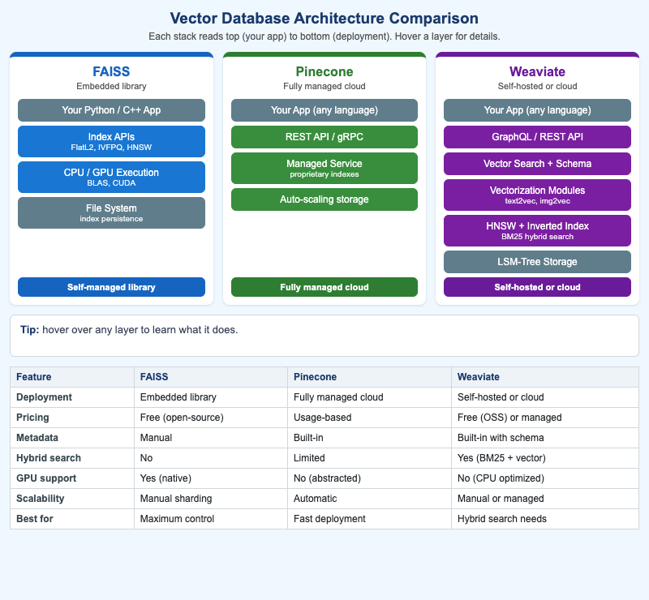Vector Database Architecture Comparison</a>
  <a href="vector-index-comparison/" title="Vector Index Comparison" style="display:block;border:1px solid #e3e7ec;border-radius:8px;overflow:hidden;text-decoration:none;color:inherit;box-shadow:0 1px 3px rgba(0,0,0,0.08);">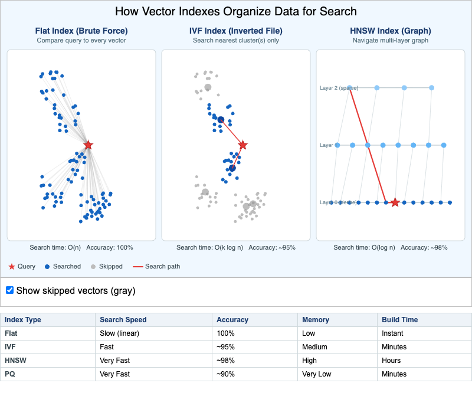Vector Index Comparison</a>
  <a href="word-embedding-vector-space-visualization/" title="Word Embedding Vector Space Visualization" style="display:block;border:1px solid #e3e7ec;border-radius:8px;overflow:hidden;text-decoration:none;color:inherit;box-shadow:0 1px 3px rgba(0,0,0,0.08);">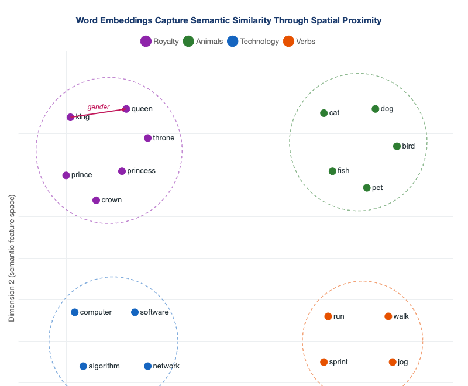Word Embedding Vector Space Visualization</a>

