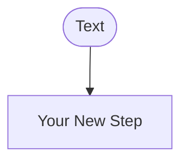

# Text Processing Pipeline Workflow

An interactive flowchart diagram showing the typical stages in preprocessing text for Natural Language Processing applications.

## Interactive Diagram

<iframe src="main.html" width="100%" height="900px" frameborder="0"></iframe>

[View Fullscreen](main.html){:target="_blank" .md-button .md-button--primary}

## Overview

Before applying sophisticated machine learning models or embeddings, NLP systems perform fundamental text preprocessing to standardize and clean input data. This workflow diagram illustrates the typical pipeline that transforms raw user input into clean, normalized tokens ready for analysis.

The pipeline handles text like `"Hello!!! How's your performance TODAY? :)"` and systematically processes it through multiple stages to produce clean tokens suitable for downstream NLP tasks.

## Workflow Steps

### 1. Raw Text Input

**Purpose:** Starting point with unprocessed user input

**Example Input:**
```
"Hello!!!   How's your  performance today?"
```

This raw input contains:
- Mixed case (Hello, performance, TODAY)
- Excessive punctuation (!!!)
- Irregular whitespace (multiple spaces)
- Emoji or special characters (:))
- Contractions (How's)

### 2. Lowercase Conversion

**Purpose:** Case normalization for case-insensitive matching

**Process:** Convert all characters to lowercase

**Result:**
```
"hello!!!   how's your  performance today? :)"
```

**Why:** Ensures "Python," "python," and "PYTHON" are treated as identical tokens, reducing vocabulary size and improving pattern matching.

### 3. Special Character Removal

**Purpose:** Remove or replace emoji, excessive punctuation, and non-alphanumeric characters

**Process:** Filter out symbols, emoji, and repeated punctuation

**Result:**
```
"hello how's your performance today"
```

**Why:** Special characters rarely carry semantic meaning for most NLP tasks and can interfere with tokenization.

### 4. Whitespace Normalization

**Purpose:** Standardize spacing

**Process:** Replace multiple spaces/tabs/newlines with single spaces, trim leading/trailing whitespace

**Result:**
```
"hello how's your performance today"
```

**Why:** Prevents tokenization errors caused by irregular whitespace.

### 5. Decision Point: Keep Punctuation?

**Application-Dependent Choice:**

- **Keep Punctuation (→ Preserve)**: Needed for sentence boundary detection, parsing, or when punctuation carries meaning (e.g., "Dr.", "U.S.A.")
- **Remove Punctuation (→ Remove)**: Better for keyword matching, bag-of-words models, or simple search applications

**If Remove:**
```
"hello hows your performance today"
```

**If Preserve:**
```
"hello how's your performance today"
```

### 6. Tokenization

**Purpose:** Split text into individual units (tokens) for processing

**Process:** Break text into words, subwords, or characters depending on application

**Result (word-level tokenization):**
```python
['hello', 'how's', 'your', 'performance', 'today']
```

**Why:** NLP models operate on tokens, not raw strings. Tokenization defines the vocabulary granularity.

**Tokenization Strategies:**
- **Word-level:** Split on whitespace and punctuation
- **Subword-level:** Split into pieces (BPE, WordPiece) to handle rare words
- **Character-level:** Finest granularity, largest sequence length

### 7. Decision Point: Apply Stemming/Lemmatization?

**Application-Dependent Choice:**

- **Apply Morphological Processing**: Reduce inflected words to root forms for vocabulary reduction
- **Keep Original Tokens**: Preserve original word forms when inflection carries meaning

**If Apply:**
- **Stemming (simple suffix removal):** "running" → "run", "flies" → "fli"
- **Lemmatization (dictionary-based):** "running" → "run", "flies" → "fly", "better" → "good"

**If Preserve:**
```python
['hello', 'how's', 'your', 'performance', 'today']
```

### 8. Processed Tokens Ready for Analysis

**Output:** Clean, normalized tokens ready for:
- Embedding lookup (word2vec, BERT)
- Classification models
- Search indexing
- Frequency analysis
- Pattern matching

## Application Examples

### Chatbot Input Processing

A conversational AI system might use this pipeline:

1. **Input:** `"What's the STATUS of my order #12345?"`
2. **After Lowercase:** `"what's the status of my order #12345?"`
3. **After Special Char Removal:** `"what's the status of my order 12345"`
4. **After Whitespace:** `"what's the status of my order 12345"`
5. **Keep Punctuation:** Yes (preserve contractions)
6. **Tokenize:** `['what's', 'the', 'status', 'of', 'my', 'order', '12345']`
7. **Lemmatize:** `['what', 'be', 'the', 'status', 'of', 'my', 'order', '12345']`

### Search Query Processing

A keyword search engine might use:

1. **Input:** `"Best Python tutorials for beginners!!!"`
2. **After Lowercase:** `"best python tutorials for beginners!!!"`
3. **After Special Char Removal:** `"best python tutorials for beginners"`
4. **After Whitespace:** `"best python tutorials for beginners"`
5. **Remove Punctuation:** Yes
6. **Tokenize:** `['best', 'python', 'tutorials', 'for', 'beginners']`
7. **Stem:** `['best', 'python', 'tutori', 'for', 'begin']`

## Decision Factors

### When to Keep Punctuation

✅ **Keep** when:
- Sentence boundary detection is needed
- Parsing grammatical structure
- Detecting questions (?) vs. statements (.)
- Abbreviations are common (Dr., U.S., etc.)
- Emoticons/emoji carry sentiment (:-), :()

❌ **Remove** when:
- Simple keyword search
- Bag-of-words models
- Frequency counting
- Topic modeling

### When to Apply Stemming/Lemmatization

✅ **Apply** when:
- Vocabulary reduction is important (memory/speed)
- Morphological variants should match ("run" = "running" = "ran")
- Working with limited training data
- Building search indexes

❌ **Preserve** when:
- Inflection carries meaning ("is" vs. "was" = tense)
- Using pre-trained embeddings (expect original forms)
- Transformer models (handle morphology internally)
- Part-of-speech tagging needed

## Color Coding

The diagram uses color coding to show different node types:

- **Purple (Start):** Entry point for raw text
- **Violet (Process Steps):** Transformation operations
- **Pink (Decisions):** Branching points requiring application-specific choices
- **Blue (End):** Output of clean, processed tokens

## Technical Details

- **Diagram Type:** Mermaid flowchart (top-down)
- **Library:** Mermaid.js 10.x
- **Node Count:** 12 nodes
- **Edge Count:** 13 edges (including conditional branches)
- **Decision Points:** 2 (punctuation handling, stemming/lemmatization)

## Common Variations

### Minimal Processing (Modern LLMs)

Modern transformer models like BERT, GPT need less preprocessing:

```
Input → Tokenization (subword) → Model
```

These models handle case, punctuation, and morphology internally.

### Aggressive Normalization (Classic ML)

Traditional bag-of-words models benefit from aggressive preprocessing:

```
Input → Lowercase → Remove Punctuation/Numbers →
Remove Stopwords → Stem → Model
```

### Domain-Specific Processing

Medical/legal text might preserve case and punctuation:

```
Input → Minimal normalization → Tokenize → Model
```

Where "Dr." vs "dr" or "U.S." vs "us" carry different meanings.

## Educational Use Cases

This workflow can be used to:

- **Teach preprocessing concepts:** Show students the systematic approach to text cleaning
- **Understand trade-offs:** Discuss when to apply each preprocessing step
- **Build intuition:** Trace examples through the pipeline
- **Debug NLP systems:** Identify where preprocessing might cause issues
- **Compare approaches:** Contrast modern (minimal) vs. classical (aggressive) preprocessing

## Related Topics

- [Chapter 1: Foundations of AI and NLP](../../chapters/01-foundations-ai-nlp/index.md) - Detailed discussion of text processing fundamentals
- Regular expressions for pattern matching
- String matching techniques
- Tokenization strategies (word, subword, character)
- Stemming vs. lemmatization algorithms
- Modern LLM tokenizers (BPE, WordPiece)

## Customization Guide

### Modifying the Flowchart

To change the workflow in `main.html`, edit the Mermaid code:



### Adding Steps

Insert new process steps between existing nodes:

```mermaid
Step3 --> NewStep["Your Step"] --> Decision1
```

### Changing Colors

Modify the `classDef` declarations at the end:

```
classDef processNode fill:#764ba2,stroke:#333,color:#fff,font-size:16px
```

## References

- Manning, C. D., & Schütze, H. (1999). Foundations of Statistical Natural Language Processing. MIT Press.
- Bird, S., Klein, E., & Loper, E. (2009). Natural Language Processing with Python. O'Reilly Media.
- [NLTK Documentation](https://www.nltk.org/) - Text preprocessing toolkit
- [spaCy Documentation](https://spacy.io/) - Industrial-strength NLP
- [Mermaid Flowchart Documentation](https://mermaid.js.org/syntax/flowchart.html)
